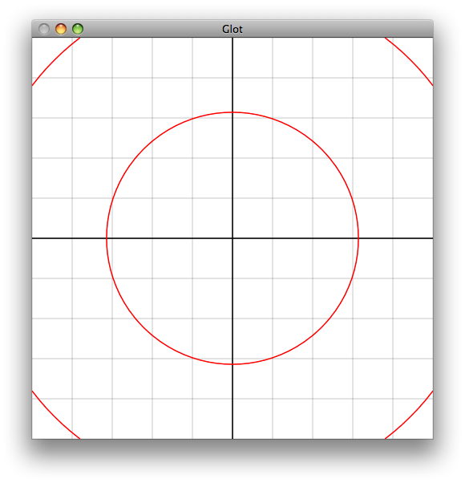
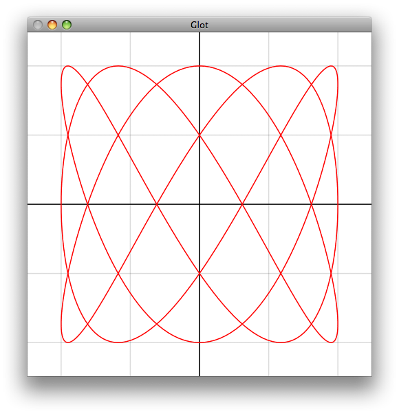
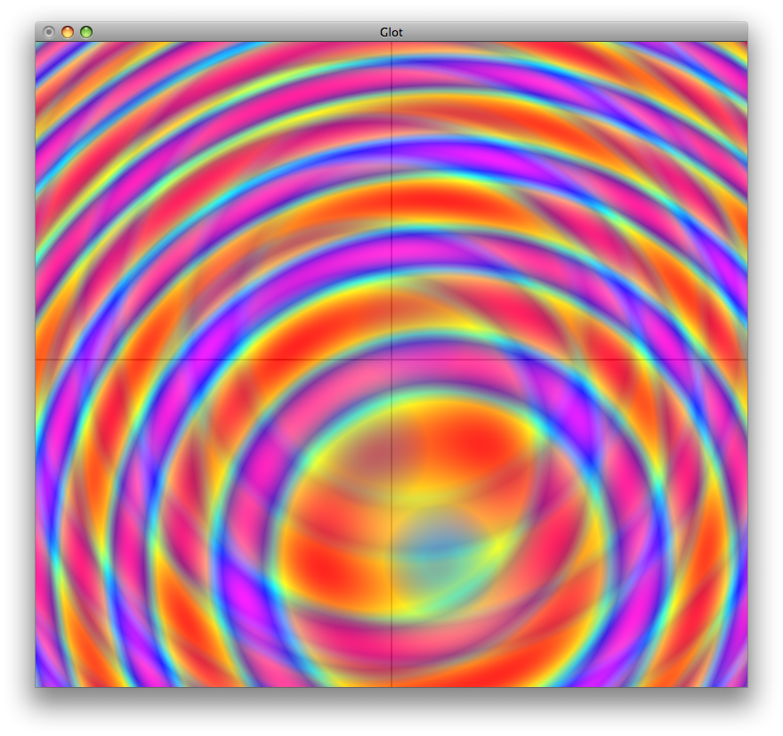
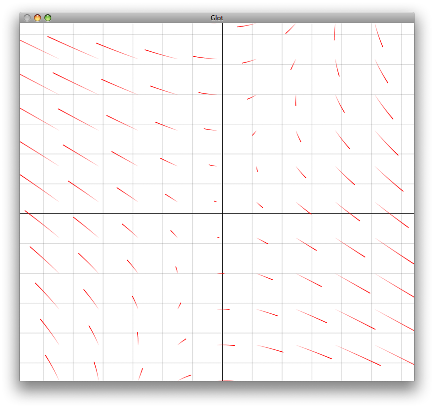

# OpenGLot

This was a project I worked on around 2009-2010. I'd become enamored of graphics, and was
experimenting with different techniques for visualizing mathematical concepts.

This offers a number of primitives which are then rendered on the GPU:

- curves
- parametric curves
- flow (advected noise texture)
- scalar fields (color denotes value)
- vector fields

Each of these primitives also supports a term for the current time since the program is
running.

## Demos

There are demos which allow the use to provide a function to render. For example, for a
scalar field:

```bash
./demos/scalar_field_demo '2.0 * pow(2.0 + t, x) - pow(y, 2.0 * t)'
```

## Gallery

Isocurves:



Lissajous:



Multiple scalar fields:



Vector field:



## State

This code does not have unit or integration tests. It has not been maintained since 2010.
